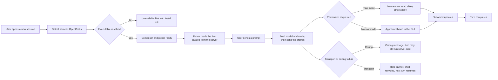
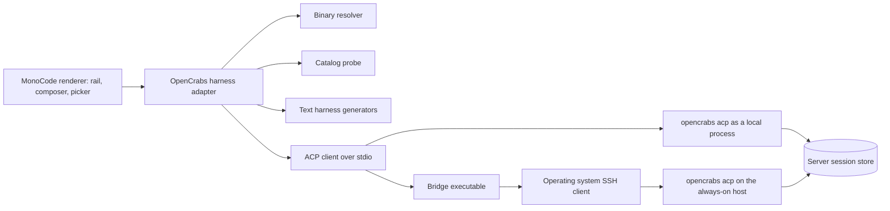

# MonoCode OpenCrabs Provider PRD

## 1. Overview

### Layer 1: Human PRD

| Field | Content |
|-------|---------|
| Problem Statement | MonoCode ships providers that are all local CLIs, so the agent brain, its session history, and its memory live on the same machine as the GUI. An operator who already runs an always-on OpenCrabs agent (VPS, home server, mini PC) ends up with two disjoint brains: the local one the GUI talks to, and the real one that holds memory, channel bindings, and scheduled work. The measurable cost is duplicated context, session history that exists in only one place, and no desktop window onto the agent that actually does the work. |
| Proposed Solution | Add OpenCrabs as a first-class harness provider in MonoCode: register it in the existing harness contract, resolve its binary locally or through a configured path, drive it over Agent Client Protocol on stdio, and read the model catalog live from the server so the picker reflects real provider/model pairs. A companion bridge executable lets the GUI stay on Windows while the agent runs on an always-on host over SSH, so one brain serves every channel. |
| Target Users | Primary: an operator of an always-on OpenCrabs instance who wants a desktop GUI without moving the brain. Secondary: a developer evaluating OpenCrabs locally on the same machine. Both are technically comfortable with a terminal, SSH keys, and editing a settings field. |
| Scope and exclusions | In scope: provider registration and availability, binary resolution and configured-path override, ACP session lifecycle with resume, live catalog in the picker, per-turn model and mode control, turn streaming, permission surfacing, attachment delivery, native slash commands, cancel/steer/compact, text-harness generation, remote-brain bridge support, honest failure messages, and the Windows setup guide. Excluded: the ACP server implementation (owned by upstream OpenCrabs), the bridge binary implementation (owned by the opencrabs-windows fork), new agent capabilities, and any upstream MonoCode provider pull request. |
| Decisions and assumptions | Reuse MonoCode's existing harness registry and adapter contract instead of a parallel mechanism (owner decision, 2026-09-30). Attachments travel as `resource_link` path references because the pinned server declares `promptCapabilities.image` false (verified in `src/acp/protocol.rs`). The upstream product name stays MonoCode out of respect for the original project (owner decision). The remote host is supplied through environment variables, never baked into the binary (owner decision, after a hostname leaked into an earlier bridge build). Assumed: the user already has working key-based SSH to their host. |
| Research basis | Upstream ACP method surface, the legacy-alias retirement window, and the `configOptions` catalog path (adolfousier/opencrabs issue 1815, answered 2026-10-02). MonoCode harness contract: `HarnessId` union and `HARNESSES` list in `src/features/sessions/model/session.ts`. Reference adapter layout from moneyacademyKE/monocode. UNVERIFIED: that our pinned 0.5.4 server already carries the ACP parity merged upstream after it, so FR-005 and FR-010 keep working against the older alias spellings. |

### Goals & Success Metrics

| Goal | Metric | Target Value | Measurement Method |
|------|--------|--------------|--------------------|
| Drive the always-on agent from a desktop window | A completed turn round-trip from the GUI to the remote agent | A reply is received for a probe prompt | Manual run, screenshot plus the server-side session listing |
| Model choice without leaving the app | Picker rows populated before the first message | At least one live provider/model row | Catalog probe output plus a picker screenshot |
| One brain across every channel | A GUI-started session visible in the server's own store | Session listed with its provider session id | Server-side listing after a GUI turn |
| A stranger can reproduce the setup | A reader with no chat history installs and verifies | Guide covers install, environment, selftest, and verification | Walkthrough on a clean Windows machine |
| Failures are diagnosable, not silent | A failed turn reports its real cause | Cause-specific message, never a generic banner | Induced failure with captured UI text |

### Layer 2: Machine Spec

| Constraint | Value |
|------------|-------|
| Product Type | Desktop application (Tauri) embedding a local ACP client |
| Primary Platform | Windows x86_64 primary; macOS and Linux follow the upstream builds |
| Deployment Target | Desktop installer plus a user-provided host for the agent runtime |
| Data Sensitivity | Private: session content, file paths, and prompts stay on the user's machine and their own host |

## 2. Requirements

### Review Focus

- Should the adapter move to the prefixed `_opencrabs/set_model` and `_opencrabs/compact` method names in the next release, and does upstream retire the legacy aliases by version or by date (adolfousier/opencrabs issue 1815)? This changes wire values inside FR-005 and FR-010, not their acceptance criteria.
- Is remote-brain mode documented as the Windows default, or as an advanced option behind the CLI-path field? This affects framing in section 4, not the requirements themselves.

### Functional Requirements

| ID | Requirement | Priority | Rationale | Acceptance Criteria IDs |
|---|---|---|---|---|
| FR-001 | OpenCrabs is registered as a first-class harness: it appears in the harness list with its own icon and label, is probed for availability like every other provider, and is selectable when starting a session. | Must | A provider that is not in the shared registry cannot be started, labelled, or configured. | AC-001, AC-002 |
| FR-002 | The provider resolves its executable from a configured path first, then from per-platform candidates (home directories, package-manager locations, and Windows `LOCALAPPDATA` locations), accepting both the plain binary and the bridge executable name. | Must | Local and remote modes must both resolve without the user editing code. | AC-003, AC-004 |
| FR-003 | A turn spawns the resolved executable with the ACP subcommand and the selected model, completes the `initialize` handshake within its budget, then opens a session with `session/new`, or resumes a previously bound session with `session/load`. | Must | The whole product depends on a live ACP session with a correct handshake. | AC-005, AC-006, AC-007 |
| FR-004 | The model picker is populated from the server's live catalog reported by `session/new` (`models.availableModels`, with the server's current pick), and is also probed before the first message so the picker is never empty on open. | Must | A picker that fills only after chatting makes model choice impossible at session start. | AC-008, AC-009 |
| FR-005 | Each turn applies the selected model and the selected runtime or plan mode server-side before the prompt is sent, so approval policy is enforced where the tools actually run. | Must | Client-side gating alone cannot constrain a remote runtime. | AC-010, AC-011 |
| FR-006 | A turn sends the prompt and streams server updates into UI events (message, reasoning, tool, completion), and reports completion once the server answers. | Must | Streaming is the core interaction; silent turns are indistinguishable from hangs. | AC-012, AC-013 |
| FR-007 | Server permission requests surface as an approval in the GUI; in plan mode the client auto-answers read and search as allow and everything else as deny, without waiting for a human. | Must | Unattended plan turns must not stall on an approval that nobody will click. | AC-014, AC-015, AC-016 |
| FR-008 | Attachments of any kind (image, audio, file) are delivered to the server as path references, with pasted blobs persisted to disk first, and an attachment that has neither a path nor data fails the send with a visible error instead of being dropped. | Must | The pinned server reads path references, so a dropped attachment silently changes what the agent sees. | AC-017, AC-018, AC-019 |
| FR-009 | Slash commands pushed by the server (`available_commands_update`, covering built-ins, skills, and user commands) become usable in the composer's command picker. | Should | The user's own commands are a headline reason to point the GUI at their own agent. | AC-020, AC-021 |
| FR-010 | The user can cancel an in-flight turn, steer it with extra guidance, and compact the session context, each mapping to the corresponding server method. | Should | Long agentic turns need interruption and context control from the GUI. | AC-022, AC-023 |
| FR-011 | The provider supplies the text-harness features MonoCode expects: session title, commit message, pull-request content, and branch name. | Should | Without them the provider is visibly second-class next to the other harnesses. | AC-024 |
| FR-012 | Remote-brain mode works through a bridge executable that reads the SSH target and remote binary path from the environment, with no host or username compiled into any shipped artifact. | Must | The GUI must be able to reach the always-on brain without shipping a site-specific binary. | AC-025, AC-026 |
| FR-013 | Failures are reported with their real cause: a prompt that exceeds the client ceiling gets its own message distinct from the transport help banner, and a failed or timed-out turn recycles the child process while keeping the session binding so the next turn resumes cleanly. | Must | A wedged transport that keeps its handle produces an endless sequence of confusing failures. | AC-027, AC-028 |
| FR-014 | A setup guide documents both modes (local and remote) end to end: install, environment variables, key-based SSH, bridge selftest, expected timings, and a verification step. | Should | The setup spans two machines and is not discoverable from the UI alone. | AC-029 |

### Non-Functional Requirements

| ID | Category | Requirement | Target | Acceptance Criteria IDs |
|---|---|---|---|---|
| NFR-001 | Performance | Session startup and catalog probing stay inside explicit budgets: the handshake gets room for a full runtime boot, and a probe that overruns is aborted and its child killed rather than left running. | Handshake budget 120 s, session request 45 s, control calls 15 s, catalog probe ceiling 45 s | AC-030, AC-031 |
| NFR-002 | Reliability | A turn that fails or times out leaves no zombie child and no stale transport; the provider session id survives so the next turn resumes, and every probe kills its child in a `finally` path. | No orphaned process after any failure; resume succeeds after a recycled transport | AC-032, AC-033 |
| NFR-003 | Security | No credential, hostname, username, or key material appears in the repository, the shipped binaries, or the guide; the remote target is read only from environment variables at runtime. | Zero host or credential strings in tree and history; environment-only configuration | AC-034, AC-035 |
| NFR-004 | Compatibility | The provider works against a 0.5.4 server and degrades gracefully when an optional server method is unsupported, instead of failing the turn. | Unsupported optional methods are logged and skipped; the turn still completes | AC-036, AC-037 |
| NFR-005 | Observability | Server stderr is forwarded to the host console log, and session state changes (bound, started, ended, config changed) are emitted as observable events. | Every lifecycle transition is observable in logs or UI events | AC-038 |

### Conditional Reliability Contracts

| Contract | Required Detail | Acceptance Evidence or N/A |
|---|---|---|
| Provider provenance and degradation | The provider must distinguish "binary present" from "route verified": availability probing is not proof that a session works. A missing optional method degrades to the client-side path (NFR-004). | AC-004, AC-036 |
| State and recovery | The provider keeps a per-thread session binding so a recycled transport resumes instead of starting over, and drops the binding when the server reports the session ended (NFR-002). | AC-032, AC-033 |
| Runtime budget and cleanup | Every spawn has a timeout, and every timeout path closes the client and kills the child; the catalog probe has a hard ceiling (NFR-001, NFR-002). | AC-030, AC-031 |
| Source-bound verification | Acceptance evidence must name the commit or build under test; a green badge alone is not evidence that the ACP path compiled or ran. | AC-005, AC-037 |
| Scheduling, retention, analytics | N/A: the provider neither schedules work nor retains its own history; sessions live in the server's store and retention is the server's policy. | N/A - no client-side scheduler, retention, or analytics surface exists. |

## 3. Core Features

### Feature 1: Provider registration and discovery

OpenCrabs joins the shared harness contract, so it is listed, labelled, probed, and selectable exactly like the providers MonoCode already ships. Governing requirements: FR-001, FR-002.

| Item | Specification |
|------|---------------|
| Inputs | Harness registry call at startup; optional user-supplied executable path from settings |
| Outputs | A harness entry with id, label, icon, and availability state; a resolved absolute executable path |
| Data Dependencies | Harness id union and harness list; provider display metadata; availability probe result |
| UI Components | Harness rail tab, harness icon, provider settings pane with a CLI-path field |
| Failure Handling | Absent executable marks the provider unavailable with an install hint and blocks session start; a configured path that does not exist is rejected with a clear error |

**Acceptance Criteria**

| ID | Requirement IDs | Type | Observable criterion | Required evidence |
|---|---|---|---|---|
| AC-001 | FR-001 | Positive | The harness appears with label OpenCrabs and its own icon, and a session can be started with it selected | Screenshot of the rail plus a session created with harness id opencrabs |
| AC-002 | FR-001 | Negative | With no executable present the provider reports unavailable with the upstream repository as the install hint and is not selectable | Availability probe output showing the unavailable hint |
| AC-003 | FR-002 | Positive | A configured path is used verbatim; with no configured path the resolver returns a candidate for the host platform | Resolver unit test plus a spawn log naming the resolved path |
| AC-004 | FR-002 | Boundary | Resolution accepts the plain binary name and the bridge name, and rejects a configured path that does not exist instead of falling back silently | Unit test covering both stems and the rejection path |

### Feature 2: ACP session lifecycle and resume

A turn brings up a transport, completes the handshake, and binds a session, preferring to resume an existing one. Governing requirement: FR-003.

| Item | Specification |
|------|---------------|
| Inputs | Resolved executable path, ACP subcommand and selected model, working directory, prior session binding when one exists |
| Outputs | A live session with a provider session id, emitted as a bound event, and a recorded resume binding |
| Data Dependencies | Per-thread live map and resume map; child-process watcher |
| UI Components | Session status in the thread header; bound-session indicator |
| Failure Handling | Handshake timeout reports the transport help message; a rejected resume falls back to a new session; any setup failure closes the client and stops the child |

**Acceptance Criteria**

| ID | Requirement IDs | Type | Observable criterion | Required evidence |
|---|---|---|---|---|
| AC-005 | FR-003 | Positive | A turn against a reachable server completes the handshake and opens a session, and the provider session id is emitted | Captured handshake response and the bound event in the log |
| AC-006 | FR-003 | Boundary | A slow-booting server still completes the handshake inside its budget, and a server that never answers fails with the transport help message | Timed run against a real server plus an induced-timeout run |
| AC-007 | FR-003 | Negative | A rejected resume falls back to creating a new session instead of failing the turn | Log showing the failed load followed by a successful new session |

### Feature 3: Live model catalog

The picker reflects the server's real provider and model pairs, read from session setup and probed before the first message. Governing requirement: FR-004.

| Item | Specification |
|------|---------------|
| Inputs | Session setup result containing the model catalog and the server's current pick |
| Outputs | Picker rows carrying provider and model pairs; the current pick reflected in the thread badge |
| Data Dependencies | Harness model store; catalog response parser tolerant of nested metadata |
| UI Components | Model picker overlay and its rows; thread model badge |
| Failure Handling | An empty or unparseable catalog leaves the static default row; an overrunning probe is aborted and its child killed |

**Acceptance Criteria**

| ID | Requirement IDs | Type | Observable criterion | Required evidence |
|---|---|---|---|---|
| AC-008 | FR-004 | Positive | After session setup the picker contains the server's pairs and the current pick appears in the badge | Catalog rows captured from the response plus a picker screenshot |
| AC-009 | FR-004 | Boundary | Opening the provider fills the picker before any message is sent, and an overrunning probe is aborted with no child left | Probe log with elapsed time plus a process check after an induced overrun |

### Feature 4: Model and mode control per turn

Each turn pushes the chosen model and the runtime or plan mode to the server before the prompt. Governing requirement: FR-005.

| Item | Specification |
|------|---------------|
| Inputs | Selected picker model; runtime mode and plan intent for the turn |
| Outputs | Server-side model and mode changes; a config-changed event so the badge agrees with the turn |
| Data Dependencies | Live session handle; model identifier mapped from the picker entry |
| UI Components | Model picker, mode control, thread model badge |
| Failure Handling | A rejected model or mode call is logged and skipped, leaving the previous selection in place; a broken transport still fails the turn |

**Acceptance Criteria**

| ID | Requirement IDs | Type | Observable criterion | Required evidence |
|---|---|---|---|---|
| AC-010 | FR-005 | Positive | Choosing a model results in a server-side change for that session and the badge shows the same model | Server response to the model call plus the config-changed event |
| AC-011 | FR-005 | Negative | A rejected model or mode call leaves the previous selection and does not abort the turn unless the transport itself is broken | Log of the ignored rejection followed by a completed turn |

### Feature 5: Turn execution and streamed updates

Prompts run over the live session and server updates stream into UI events until completion. Governing requirement: FR-006.

| Item | Specification |
|------|---------------|
| Inputs | Prompt text and attachments; session handle |
| Outputs | Streamed message, reasoning, and tool events; a completion event; a turn ceiling of 120 minutes |
| Data Dependencies | ACP client request and notification routing; update-to-event mapper |
| UI Components | Transcript, reasoning panel, tool-call rows, composer send state |
| Failure Handling | A turn past the ceiling reports the ceiling message; a transport failure reports the help banner; both recycle the child |

**Acceptance Criteria**

| ID | Requirement IDs | Type | Observable criterion | Required evidence |
|---|---|---|---|---|
| AC-012 | FR-006 | Positive | A prompt produces streamed updates surfaced as message, reasoning, and tool events, followed by completion | Captured event stream for one turn |
| AC-013 | FR-006 | Boundary | A turn past the ceiling reports the ceiling message naming the limit in minutes and noting the turn may still run server-side | Induced long turn with the captured message text |

### Feature 6: Permission requests and plan-mode policy

Server permission requests reach the user, or are auto-answered under plan mode. Governing requirement: FR-007.

| Item | Specification |
|------|---------------|
| Inputs | Server permission request carrying a tool call id, a kind, and the offered options |
| Outputs | A selected option returned to the server; a tool-updated event so the GUI shows the pending action |
| Data Dependencies | Pending approval map keyed by request id; runtime mode and plan intent |
| UI Components | Approval prompt with allow and deny choices; tool-call row |
| Failure Handling | Unknown request methods receive a method-not-found error; plan mode denies every non-read-only kind without waiting |

**Acceptance Criteria**

| ID | Requirement IDs | Type | Observable criterion | Required evidence |
|---|---|---|---|---|
| AC-014 | FR-007 | Positive | A permission request during a normal turn appears in the GUI and the decision returns to the server | Screenshot of the approval plus the response payload |
| AC-015 | FR-007 | Boundary | In plan mode, read and search are auto-allowed and every other kind is auto-denied without user interaction | Captured auto-responses for both kinds |
| AC-016 | FR-007 | Negative | An unknown request method is answered with a method-not-found error rather than ignored | Protocol log showing the error response |

### Feature 7: Attachment delivery

Any attachment reaches the server as a path reference, and nothing is dropped silently. Governing requirement: FR-008.

| Item | Specification |
|------|---------------|
| Inputs | Attachments from the composer, each with a local path or inline data plus name and media type |
| Outputs | Path-reference prompt blocks carrying uri, name, media type, and size |
| Data Dependencies | Attachment model; host command that writes a pasted blob to disk |
| UI Components | Composer attachment chips and their send state |
| Failure Handling | An attachment with neither path nor data fails the send with an error naming the file |

**Acceptance Criteria**

| ID | Requirement IDs | Type | Observable criterion | Required evidence |
|---|---|---|---|---|
| AC-017 | FR-008 | Positive | An attachment with a local path is sent as a path reference carrying name, media type, and size | Captured prompt payload |
| AC-018 | FR-008 | Boundary | A pasted blob is written to disk and then sent as a path reference under a generated name | Captured prompt payload plus the written file |
| AC-019 | FR-008 | Negative | An attachment with neither path nor data fails the send with a visible error naming the file | Negative test output and the captured error text |

### Feature 8: Native slash commands

Commands pushed by the server become usable in the composer. Governing requirement: FR-009.

| Item | Specification |
|------|---------------|
| Inputs | Server update carrying the available command list with names and descriptions |
| Outputs | Command entries exposed to the composer's command picker, cached per thread |
| Data Dependencies | Per-thread command cache with subscriber set |
| UI Components | Composer command picker and its descriptions |
| Failure Handling | Names containing whitespace or a path separator are rejected; non-command updates are passed through untouched |

**Acceptance Criteria**

| ID | Requirement IDs | Type | Observable criterion | Required evidence |
|---|---|---|---|---|
| AC-020 | FR-009 | Positive | Pushed commands appear in the command picker with their descriptions | Captured update payload plus a picker screenshot |
| AC-021 | FR-009 | Negative | A pushed name containing whitespace or a path separator is rejected rather than offered | Unit test over the parser |

### Feature 9: Session controls

Cancel, steer, and compact are reachable from the GUI. Governing requirement: FR-010.

| Item | Specification |
|------|---------------|
| Inputs | User action in the composer or session menu; optional steering text |
| Outputs | Server calls for cancel, steer, and context compaction, with an acknowledgement for compaction |
| Data Dependencies | Live session handle; short control budget |
| UI Components | Stop control, steer affordance, session menu entry for compaction |
| Failure Handling | A control call that exceeds its short budget is reported without killing the session |

**Acceptance Criteria**

| ID | Requirement IDs | Type | Observable criterion | Required evidence |
|---|---|---|---|---|
| AC-022 | FR-010 | Positive | Cancel stops an in-flight turn, steer adds guidance, and compact returns a server acknowledgement | Protocol log for all three calls |
| AC-023 | FR-010 | Boundary | A compaction call past its control budget is reported and the session stays usable | Induced-timeout log plus a subsequent successful turn |

### Feature 10: Text-harness generation

The provider supplies the shared text features the other harnesses have. Governing requirement: FR-011.

| Item | Specification |
|------|---------------|
| Inputs | Session transcript and working directory context |
| Outputs | Session title, commit message, pull-request body, and branch name |
| Data Dependencies | Shared text-harness contract |
| UI Components | Thread title, commit and pull-request panels |
| Failure Handling | A generator that cannot produce text returns a bounded fallback rather than blocking the action |

**Acceptance Criteria**

| ID | Requirement IDs | Type | Observable criterion | Required evidence |
|---|---|---|---|---|
| AC-024 | FR-011 | Positive | The provider returns a title, a commit message, a pull-request body, and a branch name through the shared contract | Unit tests over the four generators |

### Feature 11: Remote-brain bridge mode

The GUI can drive an agent on another machine without shipping a site-specific binary. Governing requirement: FR-012.

| Item | Specification |
|------|---------------|
| Inputs | Environment variables naming the SSH target and the remote binary path; a configured path pointing at the bridge |
| Outputs | A bridged ACP transport whose bytes are pumped between the GUI and the remote server |
| Data Dependencies | Operating-system SSH client; bridge executable resolved through the same candidate list |
| UI Components | Provider settings CLI-path field; no new screens |
| Failure Handling | Missing environment variables produce a clear configuration error; a failed SSH hop surfaces as a transport failure |

**Acceptance Criteria**

| ID | Requirement IDs | Type | Observable criterion | Required evidence |
|---|---|---|---|---|
| AC-025 | FR-012 | Positive | With the environment set, the bridge reaches the host and the GUI completes a session through it | Bridge selftest output plus a completed turn through the bridge |
| AC-026 | FR-012 | Negative | No host, username, or key material appears in the shipped artifact or the repository tree | String scan of the artifact plus a history scan for the host identifiers |

### Feature 12: Honest failure surfacing and transport recycling

Failures name their real cause, and a broken transport is replaced rather than reused. Governing requirement: FR-013.

| Item | Specification |
|------|---------------|
| Inputs | Errors from the handshake, the prompt call, and the child process |
| Outputs | Cause-specific user messages; a recycled transport with the session binding retained |
| Data Dependencies | Error classifier; live and resume maps |
| UI Components | Session error banner in the transcript |
| Failure Handling | Ceiling failures get the ceiling message; transport failures get the help banner; both stop the child so the next turn respawns |

**Acceptance Criteria**

| ID | Requirement IDs | Type | Observable criterion | Required evidence |
|---|---|---|---|---|
| AC-027 | FR-013 | Positive | A ceiling failure produces the ceiling message and a transport failure produces the help banner naming the ACP requirement | Two captured failure messages |
| AC-028 | FR-013 | Negative | After a failed turn the child is gone and the next turn resumes the same provider session | Process check after failure plus the resumed session id |

### Feature 13: Setup guide

Both modes are documented end to end for a reader with no chat history. Governing requirement: FR-014.

| Item | Specification |
|------|---------------|
| Inputs | Product behavior, environment variables, expected timings |
| Outputs | A guide covering install, configuration, selftest, and verification for both modes |
| Data Dependencies | None beyond the product itself |
| UI Components | None; a repository document |
| Failure Handling | Where a step cannot be verified, the guide marks it as such instead of asserting success |

**Acceptance Criteria**

| ID | Requirement IDs | Type | Observable criterion | Required evidence |
|---|---|---|---|---|
| AC-029 | FR-014 | Positive | A reader can install, configure, selftest, and verify both modes without needing missing steps | Walkthrough on a clean machine with the checklist completed |

### Feature 14: Budgets, recovery, and security posture

The cross-cutting contracts that make the features above safe to run. Governing requirements: NFR-001, NFR-002, NFR-003, NFR-004, NFR-005.

| Item | Specification |
|------|---------------|
| Inputs | Declared budgets per call class; failure paths; environment configuration |
| Outputs | Bounded waits, no orphaned children, environment-only remote configuration, observable lifecycle events |
| Data Dependencies | Timeout constants; child-process registry; console logger |
| UI Components | None directly; surfaced through the error banner and logs |
| Failure Handling | Every timeout path closes the client and kills the child; an unsupported optional method is logged and skipped |

**Acceptance Criteria**

| ID | Requirement IDs | Type | Observable criterion | Required evidence |
|---|---|---|---|---|
| AC-030 | NFR-001 | Boundary | Every call class is issued with its declared budget and a call past it fails naming the call | Timeout constant review plus an induced-timeout run |
| AC-031 | NFR-001 | Negative | An aborted catalog probe leaves no running child process | Process check immediately after an induced probe overrun |
| AC-032 | NFR-002 | Positive | A failure path leaves no orphaned child and keeps the session binding for resume | Process listing plus the resumed session id |
| AC-033 | NFR-002 | Boundary | A session-ended notification drops the live binding so the next turn spawns fresh | Log showing the ended event followed by a new spawn |
| AC-034 | NFR-003 | Positive | No credential-shaped string appears in the repository tree or the shipped binaries | Secret scan over the tree plus a string scan over the artifacts |
| AC-035 | NFR-003 | Negative | The remote target comes only from the environment at runtime and no host literal exists in the artifact | Run with the variables unset and observe the configuration error |
| AC-036 | NFR-004 | Positive | Against a 0.5.4 server every required method succeeds and the turn completes | Live turn against a 0.5.4 server |
| AC-037 | NFR-004 | Boundary | An unsupported optional method is logged and skipped and the turn still completes | Log of the skipped call plus a completed turn |
| AC-038 | NFR-005 | Positive | Server stderr appears in the host console log and lifecycle transitions are observable as events | Captured log lines plus the event sequence for one turn |

## 4. User Flow

### Primary Flow



### Interaction Detail

| Step | Actor | Action | System Response |
|------|-------|--------|-----------------|
| 1 | User | Opens a new session and picks OpenCrabs | The provider is probed, the executable is resolved, and the composer becomes available |
| 2 | System | Probes the server catalog before the first message | Picker rows appear carrying the server's provider and model pairs |
| 3 | User | Types a prompt and optionally attaches files | Attachments become path references; a pasted blob is written to disk first |
| 4 | System | Pushes the chosen model and mode, then the prompt | Streamed message, reasoning, and tool updates appear in the transcript |
| 5 | System | Raises a permission request when the server asks | Approval appears in the GUI, or plan mode answers it automatically |
| 6 | User | Cancels, steers, or compacts | The matching server call is issued and the transcript reflects the outcome |

### Edge Cases

| Edge Case | Handling | User Feedback |
|-----------|----------|---------------|
| Executable absent or configured path invalid | Provider marked unavailable, session start blocked (AC-002, AC-004) | Install hint naming the upstream repository |
| Handshake slower than the budget | Call fails naming the call that timed out (AC-006) | Help banner stating that the build must support the ACP subcommand |
| Resume rejected by the server | Falls back to a new session (AC-007) | Session continues without an error |
| Turn runs past the ceiling | Child recycled, binding kept (AC-013, AC-028) | Ceiling message naming the limit and noting the turn may still run |
| Attachment has neither path nor data | Send is refused before the prompt is issued (AC-019) | Error naming the attachment |
| Remote environment variables unset | Configuration error before spawning (AC-035) | Error naming the missing variables |

## 5. Architecture

### System Diagram



### Tech Stack

| Layer | Technology | Version | Rationale | Verification |
|-------|------------|---------|-----------|--------------|
| Desktop shell | Tauri | 2.x | Upstream MonoCode shell; the provider adds no new runtime | Present in the fork manifest, verified 2026-10-03 |
| Renderer | TypeScript with React | TS 5.x | Upstream renderer language; adapter written against it | Fork source, verified 2026-10-03 |
| Provider transport | Agent Client Protocol over stdio JSON-RPC | Protocol version 1 | The server's own interface; no adapter layer invented | `src/integrations/harness/providers/opencrabs/opencrabsProtocol.ts` |
| Agent runtime | OpenCrabs CLI | 0.5.4 or newer | Must expose the ACP subcommand | Help banner states the minimum; UNVERIFIED for versions above the pinned build |
| Remote transport | OpenSSH client via the bridge executable | Host-provided | Every target platform ships an SSH client; the bridge stays a thin pump | Bridge selftest, AC-025 |

Runtime prerequisites: an OpenCrabs build exposing the ACP subcommand (0.5.4 or newer) for local mode; for remote mode, a reachable host running that build plus working key-based SSH and the two environment variables naming the target and the remote binary path. Credential variable names only: `OPENCRABS_SSH_TARGET`, `OPENCRABS_REMOTE_BIN`. No credential value belongs in the repository, the binaries, or this document.

Safe local start and verification: install dependencies, run the renderer and shell in development mode, select the provider, and confirm the picker fills from the catalog. Proposed commands are UNVERIFIED until the builder runs them in the target checkout.

### Builder Capability Routing Contract

Act on the current request: a PRD alone does not authorize building. At startup, read this PRD and the target instructions once; inspect the host-provided available skill/tool catalog, read matching instructions, and check prerequisites. Record chosen routes, UNAVAILABLE preferences, affected IDs, and evidence limits in PROGRESS.md and the final audit. Names do not authorize installation or host or model changes; use the declared repository-native fallbacks.

For a new native build, the explicit build request authorizes scoped local work. Use the milestone outcomes in this PRD and keep live state in PROGRESS.md; show the plan and continue without another routine approval. Make the core path runnable early and preserve unrelated work. Pause only at a genuine new authority boundary, which for this product means publishing a release, pushing to a remote, changing credentials, or deploying to a host.

| Trigger | Required capability | Preferred skill/tool if available | Fallback if unavailable | Required evidence | Authority |
|---|---|---|---|---|---|
| Provider registration, catalog, or turn-flow change | Run the renderer and unit suites | The fork's package test script | Run the test runner directly on the touched test files | Test output with pass and fail counts | Local allowed |
| Verify the ACP handshake against a real server | A reachable OpenCrabs build exposing the ACP subcommand | OpenCrabs 0.5.4 or newer on the build machine | Keep the check UNVERIFIED and rely on the mock-based test | Raw handshake response captured from the server | Local allowed; no external writes |
| Verify remote-brain mode end to end | A host running OpenCrabs plus working key-based SSH | Bridge selftest followed by a live turn through the bridge | Run the bridge selftest only and mark the remote path UNVERIFIED | Selftest output plus catalog rows read through the bridge | Owner-provided host and key; no host changes |
| Package the desktop application | Tauri build toolchain | The fork's release workflow on hosted runners | A local Tauri build with the declared toolchain | Installer artifact plus a matching checksum | Owner approval before publishing a release |
| Verify picker or approval UI behavior | Visual capture of the running application | A screenshot of the running app | A component-level assertion in a test | Screenshot or test assertion | Local allowed |
| Land the change in version control | Git write access to the fork | Push a branch to the fork | Prepare a patch and leave it local | Commit identifier plus the remote branch | Owner approval before pushing |

## 6. Data Models

No client-side database is introduced: the server owns session persistence and this provider holds only in-memory state plus ACP payloads. The models below are the payload contracts the adapter reads and writes.

### Model Table

| Model | Purpose | Key Fields | Relationships | Indexes |
|-------|---------|------------|---------------|---------|
| Session setup result | Carries the session identifier and the live model catalog returned by session setup | sessionId, models.availableModels, models.currentModelId | Produces picker rows and the resume binding | None; held in memory per thread |
| Picker row | One selectable model entry shown in the overlay | id, harness, name, nativeId | Derived from one catalog entry; used to push a model change | None; held in the harness model store |
| Prompt block | One unit of the prompt sent to the server | type, text, uri, name, mimeType, size | Assembled from the typed text plus one block per attachment | None; transient per turn |
| Permission request | One approval the server asks the client to answer | callId, title, kind, optionIds, preview | Answered with a selected option; updates one tool-call row | None; held in a pending map keyed by request id |
| Command entry | One slash command the server advertises | name, description, invocation, source | Cached per thread and exposed to the composer picker | None; held in a per-thread cache |
| Lifecycle event | One observable provider state change | type, providerSessionId, model, code, message | Emitted to the transcript and the logger | None; append-only within a session |

### Validation Rules

| Field/Input | Type | Rule | Error Message |
|-------------|------|------|---------------|
| Configured executable path | string | When provided it must exist and be executable; otherwise the provider is unavailable | Configured path does not exist or is not executable |
| Model native identifier | string | Taken from the picker entry; an empty value skips the model call instead of sending an empty identifier | Model selection skipped because the entry carries no native identifier |
| Attachment | object | Must carry a local path or inline data, plus a name and media type | Cannot attach the named file: no local file path or data is available |
| Command name | string | Must be non-empty and free of whitespace and path separators | Command rejected: name contains an unsupported character |
| Environment target | string | Required in remote mode; the run fails before spawning when absent | Remote mode requires the SSH target and remote binary path variables |

## 7. Design System

The provider reuses the MonoCode design system rather than introducing a parallel one: the harness rail, picker overlay, transcript, and approval surfaces already exist, and this work adds one rail entry, one icon, and rows inside the existing picker.

### Visual Tokens

| Token | Light Mode | Dark Mode | CSS Variable |
|-------|------------|-----------|--------------|
| Primary | Existing theme value | Existing theme value | Existing theme variable |
| Background | Existing theme value | Existing theme value | Existing theme variable |
| Surface | Existing theme value | Existing theme value | Existing theme variable |
| Text | Existing theme value | Existing theme value | Existing theme variable |
| Danger | Existing theme value | Existing theme value | Existing theme variable |

No new token is introduced. The builder must reuse the existing theme variables and must not fork the palette; the acceptance evidence is that the new rail entry and picker rows render with the surrounding components and remain legible in both themes (AC-001).

### Interaction States

| State | Requirement |
|-------|-------------|
| Loading | The rail entry and picker rows show the existing loading treatment while the availability probe and catalog probe run; the composer stays disabled until a session binds |
| Empty | An empty catalog leaves the existing default row and the picker still opens; the transcript shows the existing empty state until the first turn |
| Error | Failures render in the existing session error banner; the ceiling and transport messages are distinct strings (AC-027) |
| Disabled | The rail entry is disabled with the install hint when the executable is absent (AC-002); the composer is disabled before a session binds |

## 8. API Spec

There is no HTTP API in this product. The interface is Agent Client Protocol over stdio: newline-delimited JSON-RPC between the MonoCode client and the server process, local or bridged. The table below is the method contract the adapter relies on; it is the interface a builder must satisfy and a reviewer must check.

### Endpoint Table

| Method | Path | Purpose | Auth | Request | Success | Error |
|--------|------|---------|------|---------|---------|-------|
| initialize | ACP over stdio | Handshake; advertises client capabilities | None at this layer | protocolVersion, clientCapabilities, clientInfo | Server capabilities and protocol version | Timeout after the handshake budget, reported as a transport failure |
| session/new | ACP over stdio | Open a session and return the live catalog | None at this layer | cwd, mcpServers | sessionId plus models.availableModels and the current pick | Missing session identifier fails the turn |
| session/load | ACP over stdio | Resume a previously bound session | None at this layer | sessionId, cwd, mcpServers | Restored session state | Rejection falls back to session/new |
| session/set_model | ACP over stdio | Change the model for the session | None at this layer | sessionId, modelId | Acknowledgement | Rejection is logged and skipped, previous model stays |
| session/set_mode | ACP over stdio | Set runtime or plan mode server-side | None at this layer | sessionId, modeId | Acknowledgement | Unsupported method is skipped and the client-side backstop applies |
| session/prompt | ACP over stdio | Send the turn | None at this layer | sessionId, prompt blocks | Completion after streamed updates | Ceiling or transport failure, reported distinctly |
| session/cancel | ACP over stdio | Cancel the in-flight turn | None at this layer | sessionId | Turn stops | Reported without killing the session |
| session/compact | ACP over stdio | Compact the session context | None at this layer | sessionId | Acknowledgement | Short-budget timeout is reported, session stays usable |
| session/request_permission | ACP over stdio | Server asks the client to approve an action | None at this layer | callId, kind, options | Selected option returned | Plan mode auto-answers; unknown methods get method-not-found |

### Error Format

```json
{
  "jsonrpc": "2.0",
  "id": 1,
  "error": {
    "code": -32601,
    "message": "Method not found: session/example"
  }
}
```

## 9. File Map

| Path | Purpose | Owner/Layer |
|------|---------|-------------|
| src/integrations/harness/providers/opencrabs/opencrabs.ts | Session lifecycle, turn flow, model and mode control, permissions, streaming | Provider |
| src/integrations/harness/providers/opencrabs/opencrabsAdapter.ts | Adapter wiring into the shared harness contract, including the eager catalog refresh | Provider |
| src/integrations/harness/providers/opencrabs/opencrabsProtocol.ts | Catalog parsing and native command parsing | Provider |
| src/integrations/harness/providers/opencrabs/opencrabsCatalog.ts | Host-side catalog probe with its own spawn and timeout | Provider |
| src/integrations/harness/providers/opencrabs/opencrabsPrompt.ts | Attachment-to-prompt-block conversion and pasted-blob persistence | Provider |
| src/integrations/harness/providers/opencrabs/opencrabsText.ts | Update-to-event mapping | Provider |
| src/integrations/harness/providers/opencrabs/opencrabsGit.ts | Commit message, pull-request, and branch-name generation | Provider |
| src/integrations/harness/providers/opencrabs/opencrabsTitle.ts | Session title generation | Provider |
| src/integrations/harness/core/registry.ts | Harness adapter contract the provider implements | Core |
| src/integrations/harness/core/child.ts | Child-process spawn, watch, and kill used by the provider | Core |
| src/integrations/harness/core/availability.ts | Availability probe and install hints per harness | Core |
| src/features/sessions/model/session.ts | Harness identifier union, harness list, labels, and icons | Renderer model |
| src-tauri/src/harness.rs | Native binary resolution including the OpenCrabs candidate list and accepted stems | Shell |
| docs/WINDOWS-SETUP.md | The end-to-end setup guide for both modes | Documentation |

## 10. Milestones

| # | Milestone | Done When | Status |
|---|-----------|-----------|--------|
| 1 | Local provider is runnable and visible | The provider appears in the harness list, resolves a local executable, completes a handshake, and fills the picker from the live catalog against a real server; the renderer and unit suites pass on the build under test | ⬜ Not Started |
| 2 | Complete scope: remote brain, attachments, commands, controls, failures | A turn completes through the bridge to a remote server; attachments arrive as path references; pushed commands appear in the picker; cancel, steer, and compact work; the ceiling and transport messages are distinct; the setup guide covers both modes | ⬜ Not Started |
| 3 | Integrated audit and repair | Full applicable regression plus the real user path on Windows against the remote host, covering the material failure cases; every FR and NFR carries a VERIFIED or explicitly UNVERIFIED status with source-state identity, and in-scope defects are repaired and re-run | ⬜ Not Started |

Live state and evidence belong in PROGRESS.md, referencing these milestone numbers. The PRD owns the specification; PROGRESS.md owns execution state; DECISIONS.md owns decision changes and rationale.

### Authority Policy v1

For a new native build, the user's explicit build request authorizes scoped local implementation.

One exact plan approval covers declared local runner transitions.

Pause only for a blocking decision, material scope change, or a genuine new authority boundary: external writes, destructive actions, purchases, credential changes, deployment, production, or owner acceptance.

### Traceability Matrix

| Feature | FR/NFR IDs | AC IDs | Data Model(s) | API/Interface | UI/File Path | Milestone | Required Evidence |
|---|---|---|---|---|---|---|---|
| Provider registration and discovery | FR-001, FR-002 | AC-001, AC-002, AC-003, AC-004 | Lifecycle event | Registry and availability probe | src/integrations/harness/core/availability.ts | 1 | Rail screenshot, availability probe output, resolver unit test |
| ACP session lifecycle and resume | FR-003 | AC-005, AC-006, AC-007 | Session setup result | initialize, session/new, session/load | src/integrations/harness/providers/opencrabs/opencrabs.ts | 1 | Captured handshake response, bound event, fallback log |
| Live model catalog | FR-004 | AC-008, AC-009 | Picker row | session/new catalog probe | src/integrations/harness/providers/opencrabs/opencrabsCatalog.ts | 1 | Catalog rows, picker screenshot, probe log |
| Model and mode control | FR-005 | AC-010, AC-011 | Picker row | session/set_model, session/set_mode | src/integrations/harness/providers/opencrabs/opencrabs.ts | 1 | Server acknowledgement, config-changed event |
| Turn execution and streaming | FR-006 | AC-012, AC-013 | Prompt block | session/prompt | src/integrations/harness/providers/opencrabs/opencrabsText.ts | 1 | Event stream capture, ceiling message text |
| Permissions and plan policy | FR-007 | AC-014, AC-015, AC-016 | Permission request | session/request_permission | src/integrations/harness/providers/opencrabs/opencrabs.ts | 2 | Approval screenshot, auto-answer payloads |
| Attachment delivery | FR-008 | AC-017, AC-018, AC-019 | Prompt block | session/prompt with path references | src/integrations/harness/providers/opencrabs/opencrabsPrompt.ts | 2 | Captured prompt payload, written blob, error text |
| Native slash commands | FR-009 | AC-020, AC-021 | Command entry | available_commands_update | src/integrations/harness/providers/opencrabs/opencrabsProtocol.ts | 2 | Update payload, picker screenshot, parser test |
| Session controls | FR-010 | AC-022, AC-023 | Lifecycle event | session/cancel, steer, session/compact | src/integrations/harness/providers/opencrabs/opencrabs.ts | 2 | Protocol log for the three calls |
| Text harness generation | FR-011 | AC-024 | Lifecycle event | Local generators | src/integrations/harness/providers/opencrabs/opencrabsGit.ts | 2 | Unit tests over the four generators |
| Remote brain bridge mode | FR-012 | AC-025, AC-026 | Session setup result | Bridged ACP over SSH | docs/WINDOWS-SETUP.md | 2 | Selftest output, bridged turn, artifact string scan |
| Failure surfacing and recycling | FR-013 | AC-027, AC-028 | Lifecycle event | Error classifier and child recycle | src/integrations/harness/providers/opencrabs/opencrabs.ts | 2 | Two failure messages, process check, resumed session |
| Setup guide | FR-014 | AC-029 | N/A - the guide is a document with no data model | Repository document | docs/WINDOWS-SETUP.md | 2 | Clean-machine walkthrough checklist |
| Budgets, recovery, and security | NFR-001, NFR-002, NFR-003, NFR-004, NFR-005 | AC-030, AC-031, AC-032, AC-033, AC-034, AC-035, AC-036, AC-037, AC-038 | Lifecycle event | Timeout and cleanup paths | src/integrations/harness/core/child.ts | 3 | Timeout runs, process checks, secret scan, live turn log |

### Verification Receipt and Operator Handoff

| Field | Required Value |
|---|---|
| Proven claim/status | Specification only. No application behavior is claimed as implemented or verified by this document. |
| Source state | Fork adi805/monocode, main at commit 6b944a4, inspected 2026-10-03 |
| Environment | Fork checkout at ~/src/monocode-fork; no build or runtime check was executed during generation |
| Procedure and result | Structural validation of this PRD by the toolkit validator; product behavior left UNVERIFIED |
| Side effects and cleanup | None. Generation wrote three documents and executed no application code. |
| Readiness and limitations | The specification is complete and traceable; every runtime claim still needs a build and a real server to become VERIFIED |
| One next action | No action - wait for owner approval, then give PRD.md to a fresh builder with the instruction to build it until done |

